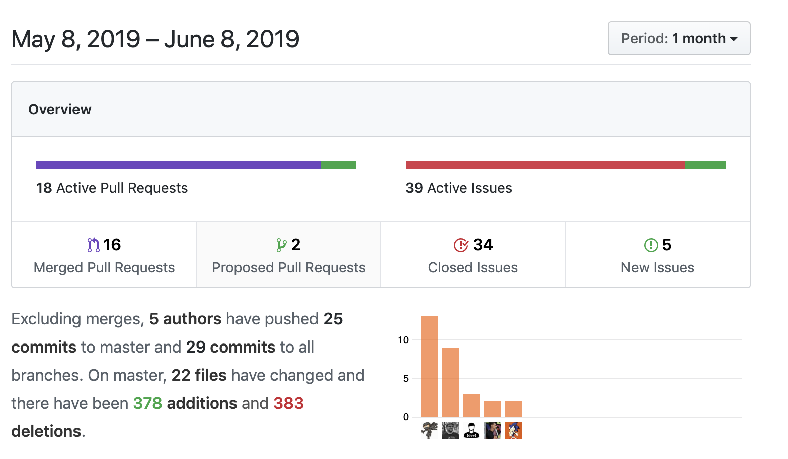

title: Why panic? Use SANIC
class: animation-fade
layout: true
footer: Why panic? Use SANIC

<!-- This slide will serve as the base layout for all your slides -->
.bottom-bar[
  {{footer}} 
]

---

class: middle

# {{title}}
### Build fast. Run fast
.right[]

<iframe class="right star" src="https://ghbtns.com/github-btn.html?user=huge-success&repo=sanic&type=fork&count=true&size=large" frameborder="0" scrolling="0" width="160px" height="30px"></iframe> <iframe class="right star" src="https://ghbtns.com/github-btn.html?user=huge-success&repo=sanic&type=star&count=true&size=large" frameborder="0" scrolling="0" width="160px" height="30px"></iframe>

<svg xmlns="http://www.w3.org/2000/svg" width="25px" height="25px" viewBox="0 0 512 512"><path d="M459.37 151.716c.325 4.548.325 9.097.325 13.645 0 138.72-105.583 298.558-298.558 298.558-59.452 0-114.68-17.219-161.137-47.106 8.447.974 16.568 1.299 25.34 1.299 49.055 0 94.213-16.568 130.274-44.832-46.132-.975-84.792-31.188-98.112-72.772 6.498.974 12.995 1.624 19.818 1.624 9.421 0 18.843-1.3 27.614-3.573-48.081-9.747-84.143-51.98-84.143-102.985v-1.299c13.969 7.797 30.214 12.67 47.431 13.319-28.264-18.843-46.781-51.005-46.781-87.391 0-19.492 5.197-37.36 14.294-52.954 51.655 63.675 129.3 105.258 216.365 109.807-1.624-7.797-2.599-15.918-2.599-24.04 0-57.828 46.782-104.934 104.934-104.934 30.213 0 57.502 12.67 76.67 33.137 23.715-4.548 46.456-13.32 66.599-25.34-7.798 24.366-24.366 44.833-46.132 57.827 21.117-2.273 41.584-8.122 60.426-16.243-14.292 20.791-32.161 39.308-52.628 54.253z"/></svg> @NeedDoseMonster
<svg xmlns="http://www.w3.org/2000/svg" width="25px" height="25px" viewBox="0 0 480 512"><path d="M186.1 328.7c0 20.9-10.9 55.1-36.7 55.1s-36.7-34.2-36.7-55.1 10.9-55.1 36.7-55.1 36.7 34.2 36.7 55.1zM480 278.2c0 31.9-3.2 65.7-17.5 95-37.9 76.6-142.1 74.8-216.7 74.8-75.8 0-186.2 2.7-225.6-74.8-14.6-29-20.2-63.1-20.2-95 0-41.9 13.9-81.5 41.5-113.6-5.2-15.8-7.7-32.4-7.7-48.8 0-21.5 4.9-32.3 14.6-51.8 45.3 0 74.3 9 108.8 36 29-6.9 58.8-10 88.7-10 27 0 54.2 2.9 80.4 9.2 34-26.7 63-35.2 107.8-35.2 9.8 19.5 14.6 30.3 14.6 51.8 0 16.4-2.6 32.7-7.7 48.2 27.5 32.4 39 72.3 39 114.2zm-64.3 50.5c0-43.9-26.7-82.6-73.5-82.6-18.9 0-37 3.4-56 6-14.9 2.3-29.8 3.2-45.1 3.2-15.2 0-30.1-.9-45.1-3.2-18.7-2.6-37-6-56-6-46.8 0-73.5 38.7-73.5 82.6 0 87.8 80.4 101.3 150.4 101.3h48.2c70.3 0 150.6-13.4 150.6-101.3zm-82.6-55.1c-25.8 0-36.7 34.2-36.7 55.1s10.9 55.1 36.7 55.1 36.7-34.2 36.7-55.1-10.9-55.1-36.7-55.1z"/></svg> @harshanarayana
---

# What is SANIC?

--

`SANIC` is an async web framework developed to run on Python 3.5+ with a single goal. 

> Build fast. Run fast

--

## Build Fast and Run Fast

--

- Keep APIs as simple as possible and consistent with other well known framework standards

- Easy and simple installation process

- Run as fast as possible


---

# Why SANIC ?

--

.col-6[

  ## Features

  - Speed

  - Supports all versions of Python starting 3.5+

  - Support for both `WSGI` and `ASGI` specs

  - Built in Test client and `pytest` plugin

  - LTS based release strategy to ensure non breaking changes and support for security fixes and features
]
--


.col-6[
  
  ## Community

  - Quick release cycle with new features and bug fixes

  - Community driven development

  - Incredibly friendly and welcoming developer community

  - Wide range of extensions and utility support

]
--

---

# Performance

.col-6[
  ## Benchmark for Request

  - TBD
]

.col-6[
  ## Benchmark for Router

  - TBD
]

---

# Installation

--

## With `ujson` and `uvloop`

```bash
pip3 install sanic
```

--

## Without `ujson` and `uvloop`

```bash
export SANIC_NO_UVLOOP=true
export SANIC_NO_UJSON=true
pip3 install --no-binary :all: sanic
```

---

# Obligatory Hello, World!

--

```python
from sanic import Sanic
from sanic.response import text

app = Sanic(__name__)


@app.route('/')
async def test(request):
    return text('Hello, World!')

if __name__ == '__main__':
    app.run(host='0.0.0.0', port=8000)

```

---

# Let's say Hello

--

```bash
pycon2019/code on  master [+?] via 🅒 sanic via 🐍 3.6.6
➜ python hello.py
[2019-06-09 00:21:32 +0530] [34171] [INFO] Goin' Fast @ http://0.0.0.0:8000
[2019-06-09 00:21:32 +0530] [34171] [INFO] Starting worker [34171]
```

--

```bash
~ via 🅒 sanic
➜ http http://localhost:8000/
HTTP/1.1 200 OK
Connection: keep-alive
Content-Length: 13
Content-Type: text/plain; charset=utf-8
Keep-Alive: 5

Hello, World!
```

---

class: middle 

# May the DEMO Gods be with US


---

# What's next for SANIC

--

.col-6[
  ## New Features

  - `ASGI` support

  - Additional extensions 

  - TBD
]
--

.col-6[
  ## WIP Items

  - `requests-async` based test client
  
  - Pluggable `json` handlers
  
  - TBD
]
--

---

# How Sanic Works

--

.col-6[
  ## Release Strategy

  - We follow CalVer with YY.MM.X

  - One release every quarter

  - Release marked for LTS will be supported until the next LTS release

  - Bug fixes and security fixes on all applicable LTS branches
]
--

.col-6[
  ## Contribution

  - Fork the [Repository](https://github.com/huge-success/sanic)

  - Develop feature with `master` as your tracking branch

  - Run tests using `tox` and `make beautify`

  - Open a PR and 🍻 
]

---

# Stats

.col-6[
  
]

.col-6[
  
]


---

class: middle

.col-6[
  # Thanks

  
]

.col-6[
  # Special Thanks

  <svg xmlns="http://www.w3.org/2000/svg" width="25px" height="25px" viewBox="0 0 480 512"><path d="M186.1 328.7c0 20.9-10.9 55.1-36.7 55.1s-36.7-34.2-36.7-55.1 10.9-55.1 36.7-55.1 36.7 34.2 36.7 55.1zM480 278.2c0 31.9-3.2 65.7-17.5 95-37.9 76.6-142.1 74.8-216.7 74.8-75.8 0-186.2 2.7-225.6-74.8-14.6-29-20.2-63.1-20.2-95 0-41.9 13.9-81.5 41.5-113.6-5.2-15.8-7.7-32.4-7.7-48.8 0-21.5 4.9-32.3 14.6-51.8 45.3 0 74.3 9 108.8 36 29-6.9 58.8-10 88.7-10 27 0 54.2 2.9 80.4 9.2 34-26.7 63-35.2 107.8-35.2 9.8 19.5 14.6 30.3 14.6 51.8 0 16.4-2.6 32.7-7.7 48.2 27.5 32.4 39 72.3 39 114.2zm-64.3 50.5c0-43.9-26.7-82.6-73.5-82.6-18.9 0-37 3.4-56 6-14.9 2.3-29.8 3.2-45.1 3.2-15.2 0-30.1-.9-45.1-3.2-18.7-2.6-37-6-56-6-46.8 0-73.5 38.7-73.5 82.6 0 87.8 80.4 101.3 150.4 101.3h48.2c70.3 0 150.6-13.4 150.6-101.3zm-82.6-55.1c-25.8 0-36.7 34.2-36.7 55.1s10.9 55.1 36.7 55.1 36.7-34.2 36.7-55.1-10.9-55.1-36.7-55.1z"/></svg> @ahopkins

  <svg xmlns="http://www.w3.org/2000/svg" width="25px" height="25px" viewBox="0 0 480 512"><path d="M186.1 328.7c0 20.9-10.9 55.1-36.7 55.1s-36.7-34.2-36.7-55.1 10.9-55.1 36.7-55.1 36.7 34.2 36.7 55.1zM480 278.2c0 31.9-3.2 65.7-17.5 95-37.9 76.6-142.1 74.8-216.7 74.8-75.8 0-186.2 2.7-225.6-74.8-14.6-29-20.2-63.1-20.2-95 0-41.9 13.9-81.5 41.5-113.6-5.2-15.8-7.7-32.4-7.7-48.8 0-21.5 4.9-32.3 14.6-51.8 45.3 0 74.3 9 108.8 36 29-6.9 58.8-10 88.7-10 27 0 54.2 2.9 80.4 9.2 34-26.7 63-35.2 107.8-35.2 9.8 19.5 14.6 30.3 14.6 51.8 0 16.4-2.6 32.7-7.7 48.2 27.5 32.4 39 72.3 39 114.2zm-64.3 50.5c0-43.9-26.7-82.6-73.5-82.6-18.9 0-37 3.4-56 6-14.9 2.3-29.8 3.2-45.1 3.2-15.2 0-30.1-.9-45.1-3.2-18.7-2.6-37-6-56-6-46.8 0-73.5 38.7-73.5 82.6 0 87.8 80.4 101.3 150.4 101.3h48.2c70.3 0 150.6-13.4 150.6-101.3zm-82.6-55.1c-25.8 0-36.7 34.2-36.7 55.1s10.9 55.1 36.7 55.1 36.7-34.2 36.7-55.1-10.9-55.1-36.7-55.1z"/></svg> @vltr

  <svg xmlns="http://www.w3.org/2000/svg" width="25px" height="25px" viewBox="0 0 480 512"><path d="M186.1 328.7c0 20.9-10.9 55.1-36.7 55.1s-36.7-34.2-36.7-55.1 10.9-55.1 36.7-55.1 36.7 34.2 36.7 55.1zM480 278.2c0 31.9-3.2 65.7-17.5 95-37.9 76.6-142.1 74.8-216.7 74.8-75.8 0-186.2 2.7-225.6-74.8-14.6-29-20.2-63.1-20.2-95 0-41.9 13.9-81.5 41.5-113.6-5.2-15.8-7.7-32.4-7.7-48.8 0-21.5 4.9-32.3 14.6-51.8 45.3 0 74.3 9 108.8 36 29-6.9 58.8-10 88.7-10 27 0 54.2 2.9 80.4 9.2 34-26.7 63-35.2 107.8-35.2 9.8 19.5 14.6 30.3 14.6 51.8 0 16.4-2.6 32.7-7.7 48.2 27.5 32.4 39 72.3 39 114.2zm-64.3 50.5c0-43.9-26.7-82.6-73.5-82.6-18.9 0-37 3.4-56 6-14.9 2.3-29.8 3.2-45.1 3.2-15.2 0-30.1-.9-45.1-3.2-18.7-2.6-37-6-56-6-46.8 0-73.5 38.7-73.5 82.6 0 87.8 80.4 101.3 150.4 101.3h48.2c70.3 0 150.6-13.4 150.6-101.3zm-82.6-55.1c-25.8 0-36.7 34.2-36.7 55.1s10.9 55.1 36.7 55.1 36.7-34.2 36.7-55.1-10.9-55.1-36.7-55.1z"/></svg> @sjsadowski

]